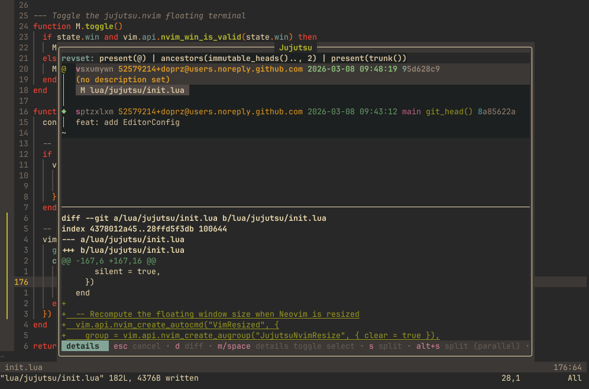
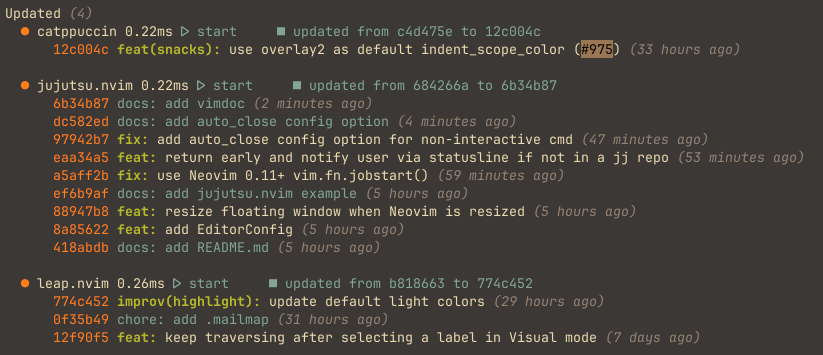

## jujutsu.nvim

 

This morning I got tired of context-switching and decided to do something about it. The result: my first Neovim plugin, written in Lua - [jujutsu.nvim](https://github.com/doprz/jujutsu.nvim) .

## A Bit of Background

I recently migrated from Git to [Jujutsu (jj)](https://github.com/jj-vcs/jj), and honestly, it's been a breath of fresh air. 
If you haven't tried it, jj is a modern version control system that's thoughtfully designed and surprisingly ergonomic once it clicks.

The workflow shift was smooth, but there was one rough edge: I lost the nice integration and developer experience of my old Neovim setup. Previously I used [lazygit.nvim](https://github.com/kdheepak/lazygit.nvim), 
which pops open a floating terminal running the lazygit TUI right inside Neovim. It's seamless - one keymap, full VCS access, dismiss and you're back to your code.
With jj, I found myself reaching for a separate terminal window, a tmux pane, or alt-tabbing to run `jj` commands or launch [jjui](https://github.com/idursun/jjui).
It worked, but for something that I do a dozen times a day it felt like unnecessary friction.

## The Plugin

**jujutsu.nvim** brings `jjui`, the Jujutsu TUI, into a floating scratch terminal inside Neovim.
One keymap opens it, another closes it, and you're right back where you left off. No terminal switching, no tmux gymnastics, no lost context.

It's straightforward by design. A focused tool that does one thing well - the Unix philosophy applied to a Neovim plugin.

 

*There's something genuinely surreal about seeing your own plugin scroll past in lazy.nvim's update log and even more so knowing it's now part of your daily workflow.*

## Why Build It?

The honest answer: I couldn't find it already existing, and the itch was too specific to wait for someone else to scratch it. Writing a Lua plugin for Neovim turned out to be far more approachable than I expected; 
the API is well-documented, the feedback loop is fast, and there's a great ecosystem to learn from.

There's something satisfying about solving your own problem with your own tools. The whole thing came together in a single morning session.

## Who Is This For?

If you live inside Neovim and you've made the jump to Jujutsu (or you're curious about it), **jujutsu.nvim** might be exactly what you're missing. 
Check it out, open an issue, or send a PR. I'm just getting started with Lua plugin development and would welcome the feedback.
