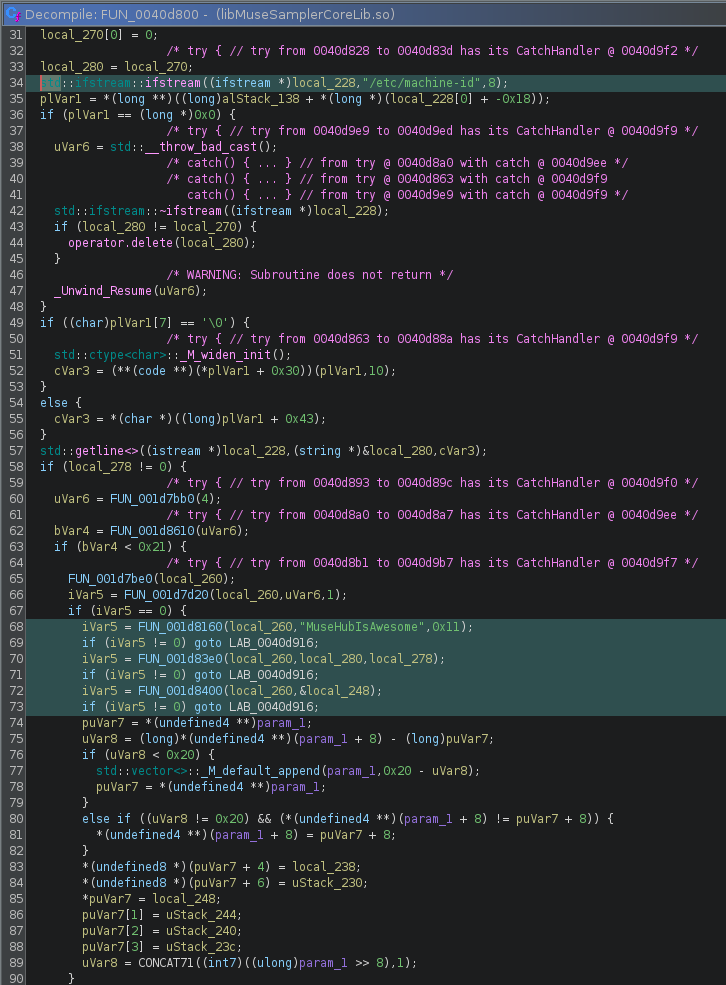

MuseScore Studio 4 on Void Linux (and other non-systemd distributions) fails to
initialize its audio sampling engine, MuseSampler, with the following error:

```sh
MuseSamplerLibHandler::init | Could not init lib
MuseSamplerResolver::init | Could not init MuseSampler: /home/<username>/.local/share/MuseSampler/lib/libMuseSamplerCoreLib.so, version: 0.105.1
```

MuseScore launches and the UI works fine, but all MuseSounds instruments are
unavailable. The same AppImage with the same MuseSounds installation works
perfectly on Fedora Linux. This post documents the full investigation, including
reverse engineering the closed-source `libMuseSamplerCoreLib.so`, and the fix.

## Testing Environment
- Void Linux (glibc), runit init
- Artix Linux, OpenRC init
- Fedora Linux, systemd init

## Initial Debugging

### Ruling Out Missing Dependencies

The first suspicion was missing
shared libraries. Running `ldd` on the sampler library showed all dependencies
resolving cleanly with no not found entries. The system was running glibc, not
musl, so libc compatibility was not the issue.

### Tracing Runtime Behavior

Since `ldd` was clean, the failure had to be
happening during runtime initialization. Extracting the AppImage into a squashfs and running
`strace` on the binary revealed the library was opening successfully (returning a
valid file descriptor), but something during init was causing it to fail.

```sh
symbol lookup error: /home/<username>/.local/share/MuseSampler/lib/libMuseSamplerCoreLib.so:
undefined symbol: _ZN3DRM9AntiDebug24scheduleThreadTimedCrashEv
```

Demangled, this is `DRM::AntiDebug::scheduleThreadTimedCrash()` - a DRM callback
that the sampler library expects the host binary to export. However, this error
appeared on both the non-systemd operating systems and the working Fedora system, making
it a red herring. The dynamic library handles this missing symbol gracefully.

## Reverse Engineering with Ghidra

### Process Name Whitelist

Reverse engineering `libMuseSamplerCoreLib.so` in Ghidra revealed the `ms_init`
function. Near the top of the function is an early-exit check:
```c
  cVar2 = FUN_00406510();
  if (cVar2 == '\0') {
    return 0xffffffff;
  }
```

Decompiling `FUN_00406510` revealed a process name whitelist. The function reads
the executable path (via `/proc/self/exe` or `argv[0]`), extracts the basename after
the last `/`, and checks it against three strings:
- "MuseScore-4"
- "MuseScore-5"
- "mscore"

The AppImage binary is named `mscore4portable`, which matches the last string.
This seems to be a check to ensure the dynamic library is only initialized from
within a legitimate MuseScore binary.

### Instrument Folder Validation

Continuing deeper into `ms_init`, the next significant check was `FUN_00405790`.
This function calls `getenv("MUSESAMPLER_INSTRUMENT_FOLDER")` and, if set,
validates the path. If not set, it calls `FUN_00405e40`, which opens
and parses the config file at `~/.local/share/MuseSampler/.config` to find the
instrument folder path. In this case, the config file contained:
`/home/<username>/Muse Sounds`

Both code paths ultimately call `FUN_00328cc0` to validate the instrument folder.
Inside that function, it verifies the existence of a `.instruments` file inside
the sounds folder, then calls `FUN_00416390` which performs a machine fingerprint
comparison.

### Reverse Engineering the Fingerprint Check

`FUN_00416390` is the core validator. Its logic:

1. Verifies `<instrument_folder>/.instruments` exists
2. Calls `FUN_0040d800` to compute a machine-specific fingerprint
3. Base64-encodes that fingerprint:
```c
  *(char *)((long)puVar8 + sVar14) =
       "ABCDEFGHIJKLMNOPQRSTUVWXYZabcdefghijklmnopqrstuvwxyz0123456789+/"
       [iVar5 >> ((char)uVar12 - 6U & 0x1f) & 0x3f];
```
4. Reads a stored fingerprint from `.instruments` via a separate lookup function
5. Compares the two with `bcmp` - if they don't match, init fails

Decompiling `FUN_0040d800` revealed exactly how the fingerprint is generated:

 

```c
std::ifstream::ifstream((ifstream *)local_228,"/etc/machine-id",8);
  // ...
  if (iVar5 == 0) {
    iVar5 = FUN_001d8160(local_260,"MuseHubIsAwesome",0x11); // Sets HMAC key
    if (iVar5 != 0) goto LAB_0040d916;
    iVar5 = FUN_001d83e0(local_260,local_280,local_278); // Processes machine-id
    if (iVar5 != 0) goto LAB_0040d916;
    iVar5 = FUN_001d8400(local_260,&local_248); // Produces 32-bype output
    if (iVar5 != 0) goto LAB_0040d916;
  }
```

The function reads `/etc/machine-id`, runs it through a keyed hash function using
the hardcoded key `"MuseHubIsAwesome"`, and produces a 32-byte fingerprint. This
fingerprint is base64-encoded and stored in `.instruments` when MuseSounds Manager
downloads an instrument pack. On subsequent launches, MuseSampler recomputes the
fingerprint and compares it against the stored value.

## The Root Cause

There are two distinct but related problems:

**Problem 1**: Void Linux is missing `/etc/machine-id`. Void does not create
`/etc/machine-id` by default. Its machine ID lives at
`/var/lib/dbus/machine-id`. Since `FUN_0040d800` exclusively reads
`/etc/machine-id`, the fingerprint computation fails entirely on Void - the file
simply isn't there to read. This means MuseSounds Manager generates a bad or
empty fingerprint when writing `.instruments`, and MuseSampler can never verify
it successfully on subsequent launches.

**Problem 2**: `.instruments` contains a bad fingerprint and needs to be
regenerated. Even on Artix Linux, which does have `/etc/machine-id`, MuseSampler
still failed on a fresh install. The fix in both cases was the same: delete
`.instruments` and re-download an instrument pack, forcing MuseSounds Manager to
regenerate it with a valid fingerprint. The exact reason MuseSounds Manager
generates a bad `.instruments` on non-systemd distros on the first run is not
fully clear, but may relate to the absence of a proper `logind` session when
MuseSounds Manager first runs.

## The Fix

In order to fix this, it's as simple as deleting the existing `.instruments`
file, and re-download any instrument pack via MuseSounds Manager.

```sh
rm ~/Muse\ Sounds/.instruments
```

Non-systemd distributions and others with `/etc/machine-id` missing will need to
create a symlink to the dbus machine ID:

```sh
sudo ln -s /var/lib/dbus/machine-id /etc/machine-id
```

## Affected Distributions

Any Linux distribution that does not create `/etc/machine-id` by default will hit
this issue. This includes Void Linux and potentially other non-systemd distributions.

## Why Fedora Works Out of the Box

Fedora uses systemd, which writes `/etc/machine-id` during first boot via
[systemd-machine-id-setup]("https://www.freedesktop.org/software/systemd/man/latest/systemd-machine-id-setup.html").
MuseSounds Manager can read it successfully, generates a valid fingerprint, and
stores it in `.instruments`. MuseSampler verifies it correctly on every
subsequent launch. On non-systemd distros, something about the environment
during the initial MuseSounds Manager run causes it to write a bad fingerprint
into `.instruments`. On Void the cause is clear - `/etc/machine-id` simply
doesn't exist. On Artix the cause is less obvious but the symptom and fix are
the same.

## See Also

[MuseScore GitHub Issue #32911 - MuseSampler fails to initialize on non-systemd Linux distributions](https://github.com/musescore/MuseScore/issues/32911) 
