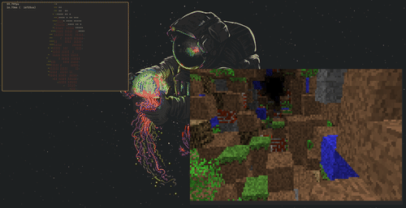

Some of the best projects stem from real frustrations. I've personally struggled with creating small GIFs for project documentation on Wayland - no existing solution worked well. My workaround? Screen record with OBS, manually convert with ffmpeg. Time-consuming, janky, and frustrating.

*wlgif demo showcasing* [rs-cube](https://github.com/doprz/rs-cube) and [minecraft_tunnel](https://github.com/doprz/minecraft_tunnel)

So I built **wlgif** - a lightweight screen recorder for Wayland that captures regions as GIFs. What used to take several minutes now takes less than 10 seconds.

GitHub: https://github.com/doprz/wlgif

Stats: ~1000 lines of Rust code, 99KiB repository size, with scc estimating $38k development cost.

**The problem:**

Screen-to-GIF on Wayland has been surprisingly painful. Most tools only work on specific compositors, forcing users into awkward workarounds. wlgif solves this with a dual-backend architecture that **works on ANY Wayland compositor** - whether you're running GNOME, KDE, Sway, Hyprland, or anything else.

**Technical architecture:**

The dual-backend system provides universal Wayland compatibility:

**XDG Desktop Portal backend** (universal):
1. Portal request via D-Bus for compositor screen access
2. Compositor's native picker for source selection
3. PipeWire captures video stream from compositor
4. GStreamer encodes stream to MP4

**wlroots backend** (optimized for wlr-based compositors):
1. slurp for interactive region selection
2. wf-recorder captures via wlroots screencopy protocol

**Backend abstraction → GIF conversion:**
1. ffmpeg analyzes video to generate optimal 256-color palette
2. ffmpeg applies Floyd-Steinberg dithering for final encoding

This two-pass encoding produces significantly smaller, better-looking GIFs than naive single-pass conversion.

**Development infrastructure:**

Built in Rust with first-class Nix support. The real breakthrough: I reverse-engineered Ghostty's NixOS VM approach to create declarative, reproducible integration test environments using QEMU - true infrastructure as code. 

A single Nix command spins up a VM with the new wlgif derivation, automatically configures SPICE connection, sets up VM tools, and connects via virt-viewer. Code on host, test specific backends in VMs that rebuild with the updated wlgif binary. Thanks to Nix's derivation system, only the changed components need to be rebuilt - the entire test environment is declarative and reproducible.

Big thanks to the Ghostty project for the VM testing inspiration and nix.dev for excellent NixOS VM documentation.

#Rust #Wayland #Linux #OpenSource #Nix #NixOS #DevOps #IntegrationTesting
